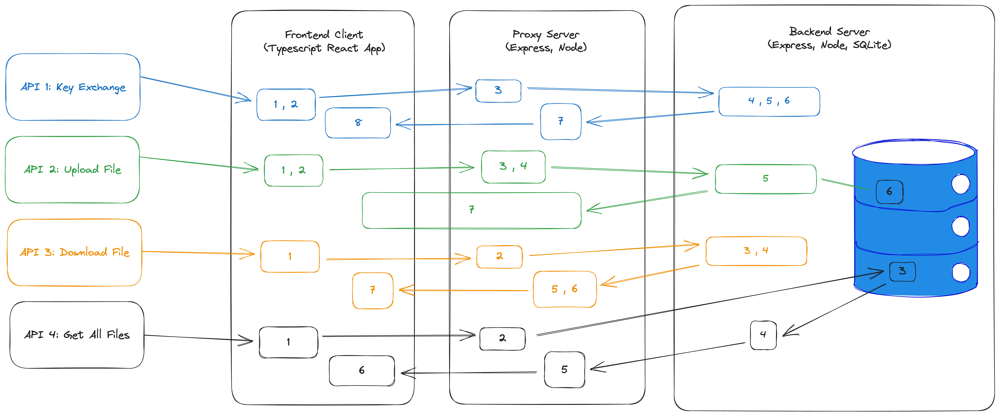

# Encryption Proxy Gateway

## Overview
Encrypted file transfer application that allows users to upload and download files from their browser whilst maintaining encryption at all stages

### Stack
#### Frontend:
For the frontend client, I decided to create a Typescript React App. I chose React because it fit seemlessly with the backend stack of Express.js on node and because it simplifies the build configurations and allows for quick development.

#### Backend and Middleware:
For the backend and proxy servers, I decided to Express.js built on the node javascript runtime environment. Express is clean and simple for this basic use case, and supports our simple REST mechanics. Overall the Express-React-Node stack works pretty seamlessly together.Sqlite was my choice of db as it is ideal for local data storage for individual applications and devices

## Diagram


## API Flows
Key Exchange
1. Frontend generates client key pair
2. Frontend sends client pub key to proxy
3. Proxy forwards client pub key to backend
4. Backend generate server key pair
5. Backend receives client pub key and generates shared secret (stored in memory)
6. Backend sends response to proxy with server pub key
7. Proxy sends response to client with server pub key
8. Frontend receives server pub key and generates shared secret (stored in memory)

Upload File
1. Frontend selects file from disk
2. Frontend encrypts file with key derived from shared secret 
3. Proxy intercepts call, writes encrypted data to disk
4. Proxy forwards call to backend
5. Backend receives encrypted file and decrypts it
6. Backend write file to disk and stores to db
7. Only response code is passed back to proxy and frontend

Download File
1. Frontend specifies path for file they want to download
2. Proxy forwards call to backend
3. Backend reads desired file from disk
4. Backend encrypts file and sends as response to Proxy
5. Proxy intercepts response from backend, writes encrypted data to disk
6. Proxy forwards response to frontend
7. Frontend decrypts file and downloads it

Get All Files
1. Frontend makes call
2. Proxy forwards call to backend
3. Backend queries db and responds with list of filenames
4. Backend Responds with list of filenames
5. Proxy forwards response to frontend
6. Frontend re-renders to display updated files

### File Structure (of relevant files)
```
/frontend
├── /src
│   ├── EncryptionStatus.tsx
│   ├── FileList.tsx
│   ├── FileTransferComponent.css
│   ├── FileTransferComponent.tsx
│   ├── FileUpload.tsx
│   ├── encryptionUtils.ts
│   └── useFileTransfer.tsx
/server-e
├── /uploads
├── database.db
├── server.js
/server-m
├── /uploads
├── /downloads
├── proxy.js
├── test.js
```

### Run Instructions:
1. Open 3 tabs in terminal
2. Tab 1: 
    1. From the root directory `cd server-e`
    2. `npm install`
    3. `node server.js`
3. Tab 2:
    1. From the root directory `cd server-m`
    2. `npm install`
    3. `node proxy.js`
4. Tab 3:
    1. From the root directory `cd frontend`
    2. `npm install --legacy-peer-deps`
    3. `npm start`

#### Test Run Instructions:
Make sure to have run the program at least once before testing
1. From the root directory `cd server-m`
2. `npx mocha`

### Encryption
- Protocols: I used secp521r1 for creating the elliptic curve and aes-256-gcm for the cipher. To be honest, I am not extremely familiar with these protocols, but the quick research I did revealed that they were compatible with the stack I chose. In React, I used the crypto-browserify module that was already provided for us, and in node.js I used the crypto module.
- Key Exchange Logic: In order to maintain encryption across the full stack, it was necessary to generate key pairs at the backend and client-side levels. I used a ECDH key exchange. To summarize, both parties initially generate a public and private key. The two parties then exchange public keys. I used an /exchange-keys endpoint to accomplish this. Using their own private keys and the other party’s public key, a shared secret can be generated. From this shared secret, a symmetric key is derived for each party which we can use to encrypt and decrpyt messages.

### Other Additions
- SQLite db that maintains records of all uploaded files
- Added Status component that indicates when application is encrypting or decrypting
- Preloaded folder to have existing files 
- Store encrypted content in middle ware layer for proof that data is encrypted
- Used eslint to clean code
- Happy path testing using mocha of all 4 APIs
- Added try/catch blocks for error handling

### Potential Future Improvements:
- Using service workers to help with the encryption and decryption - this would have accomplished the first bonus challenge of increased performance and allow for users to start another file upload/download while another is being encrypted
- Adding a delete file API would make the application more complete and well-rounded but I found it out of scope as there is no encryption involved in that process.
- Adding accounts + authentication and storing passwords in a db - also found it out of scope
- Additional error handling: I accounted for the most common errors, but there are still more that can be detailed very specifically
